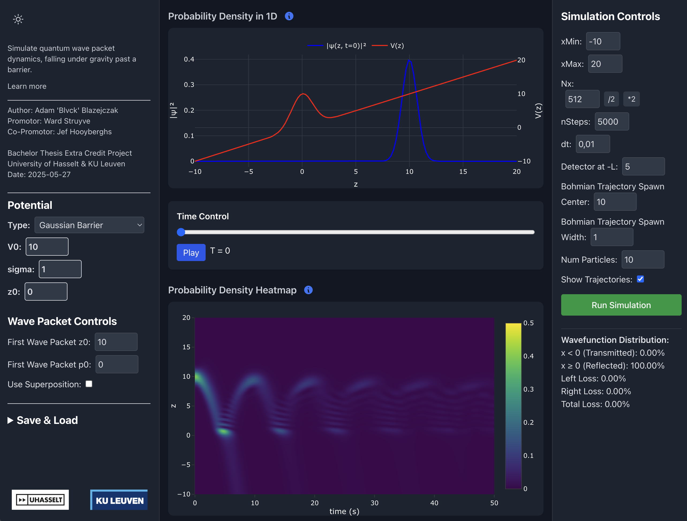
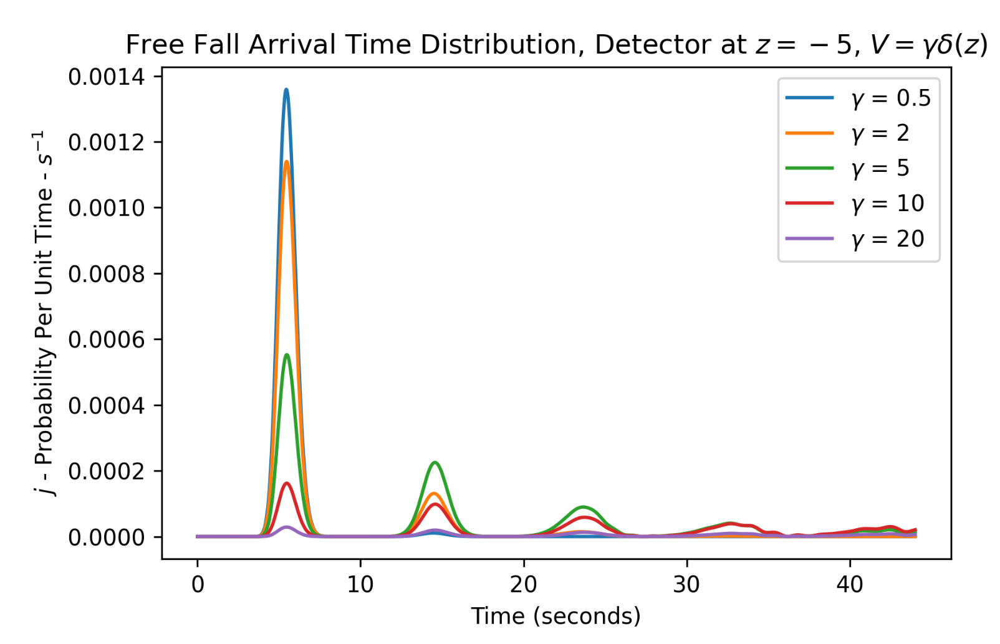
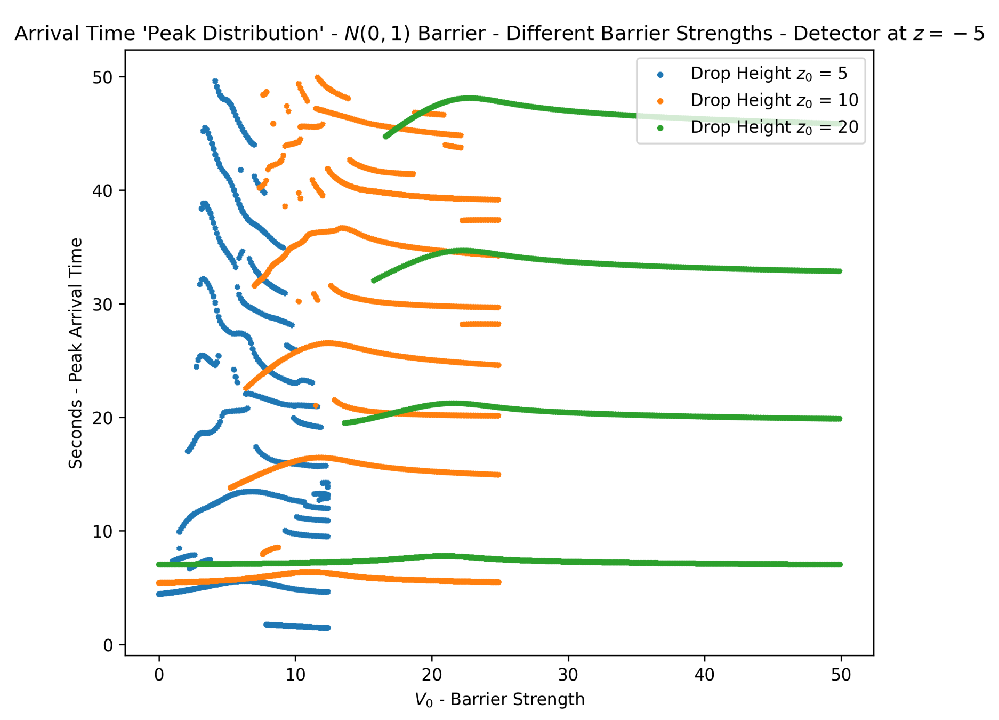
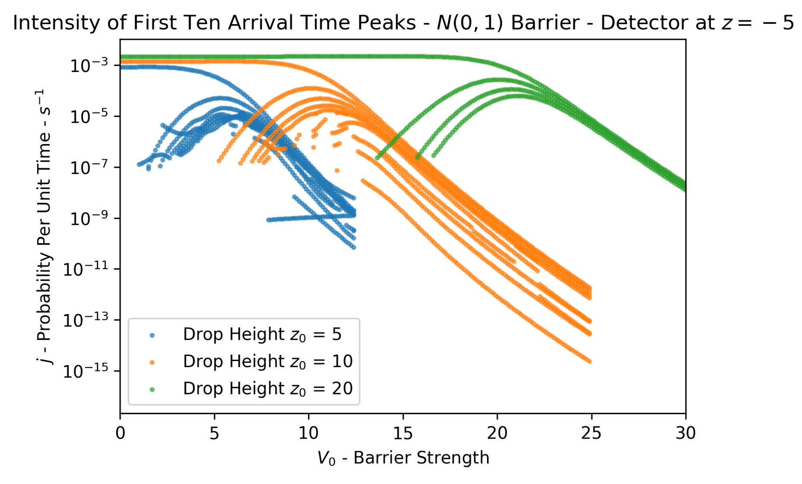

# Quantum Arrival Time Distribution In Free Fall Experiments Across Opaque Barriers

Here's how the online app looks like that I made for the thesis (add-on)

And this is what an arrival time distribution looks like for opaque barrier, for particles in free fall:

When arrival time peaks are analysed, then very interesting graphics like these are produced for different changing variables:

The above graphics are discussed in the paper as being **new results** and ready for **experimental verification** and **further theoretical treatment**.

## ABSTRACT

**Canonical quantum mechanics focuses on measurement outcomes, while alternative formulations like Bohmian mechanics describe the particle’s path from A to B, while yielding the same predictions. In experiments like the double-slit, the concept of ”travel time” or ”arrival time” lacks precision due to issues with initial conditions. However, free-fall experiments with quantum particles on opaque barriers might resolve this. This study introduces an analysis of such setups, calculating arrival times using Bohmian probability currents at the detector location. The resulting distributions reveal band formation, tunneling resonances, and other features, suggesting further theoretical and experimental exploration. The study also compares tunneling times predicted by the Larmor clock for spin-1/2 particles and Bohmian mechanics. Both theories agree with square barriers, but show dif- ferences with Gaussian barriers, highlighting the ad hoc nature of the Larmor clock theory.**

## Introduction

This repository contains my thesis and the code used for producing the quantum mechanical arrival time results in free fall experiments. As far as the authors are concerned, publications about free fall experiments in quantum mechanics across gaussian (and opaque) barriers is scars, making this indeed an insightful study into arrival times.

There are three main conclusions from this Bachelor's Thesis:
1. Succesful production of quantum particle in free fall simulations on commercial-grade computers, and the implementation of this code in python and javascript, together with a bunch of automation code.
2. Succesful and new arrival time distribution simulation analysis for many changing variables. Ready for further theoritical treatment and experimental verification.
3. Bütticker's Larmor Clock is an ad hoc measurement as argued from first principles, and a Bohmian view on the the notion of "tunneling time" confirms this.

## Repo Structure

Most important notebooks:
- [1d Free Fall Experiment Automation - with Yoshida Method](notebooks/25_05_03_daspaper_1D_ArrivalTime.ipynb)
- [2d Free Fall Experiment Automation - with Split Operator Method](notebooks/25_03_21_2d_spin_splitops_automation.ipynb)
- [Post Simulation Analysis - Larmor Clock vs Bohmian Tunneling Time](notebooks/25_05_01_larmor_vs_bohmian_tunneling_time.ipynb)
- [Post Simulation Analysis of Arrival Time Peaks](notebooks/25_05_18_arrivaltime_peaks.ipynb)
- [Creation of some graphics in the paper](notebooks/25-05-24_graphs_presentation.ipynb)

All helper code for the required notebooks are found in [the helpers folder](notebooks/helpers/).

The paper is available [here]("Deliverable/Bachelor Presentation - Analysis of Arrival and Tunneling Time In Free Fall Experiments With Opaque Barriers.pptx"), and the corresponding presentation is available [here](<Deliverable/Bachelor_Thesis_Arrival_Time_in_Quantum_Mechanical_Free_Fall_Experiments_Final.pdf>). Its `LaTeX` source code is available [here](/paper/).

## About The App

The app was first written to have an interactive environment for working with free fall experiment. Upon moving to 2D simulations, which easily produce 6-10 Gb of data for only 3 second simulations, a switch has been made to `python`, resulting in the notebooks in this repository.

The application has been reworked to make it more mobile friendly, and as a nice little surprise for the audience by the end of the presentation. The application is written in JSX and React, and the simulation code is just running off pure javascript. For fast fourier transformations the library `fft-js` is being used.\

For local development and running of the application, perform `npm install` after having the repo cloned, and run the application locally with `npm start`. The app can be built into a static environment.

